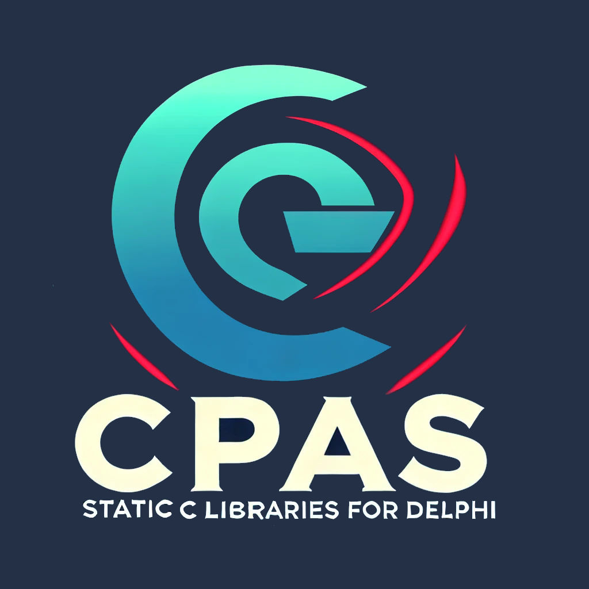

[](https://discord.gg/tPWjMwK) [](https://twitter.com/tinyBigGAMES)

# CPas
### Static C Libraries for Delphi

Current list of static C libraries available. More will be added by myself and hopfully other people in the community. If you wish to contribute, submit a PR. Follow the project format in this repo.

| Name           | Latest Version  | Category | Description |
|----------------|----------------|----------------|----------------|
| Print          | 1.0.0| Console  | Print colored text to the console |
| [SQLite](https://github.com/sqlite/sqlite) | 3.46.0 | Database | Local SQL database library |


###  Utilizing C code in Delphi app
From Delphi 12.1 onwards compiled C code can be incorporated into Delphi EXE without the need to use or include a DLL.
 
#### In short
1. Including the `.o` file from C++ Builder `{$L Unit1.o}`.
2. Exposing all the calls the C code relies on, and referencing them in Delphi (long list already exists, figuring out more is easy). See `CPas.CRuntime unit`.
3. Defining Delphi headers for the actual C routines in the `.o` file.
 
#### Explanation
- The trick is to build a `CRuntime` unit to reference all the missing functions the C code needs.
- C++ Builder's Win64 Modern platform is Clang based and links against the UCRT runtime, making a dll/exe in C, with `TDUMP` to show all the C runtime routines it references.
- It is ‘trivial’ to add to the `CRuntime` unit and build up a unit of routines in Delphi. 
- Since Win64 Modern platform links only to the dynamic UCRT, only the routine address is needed, not a proper definition. i.e. `procedure wprintf; external ucrt;` is enough since the host app does not need to call it directly. As long as the code in the `.o` can reference `wprintf`, it will compile.

#### Instructions
- Compile the project with C++ builder, take the `.o` file and add it to the Delphi wrapper unit `{$L Unit1.o}`, with reference to `CRuntime` unit.
- Any C library that one would normally have to use via a `.dll`, can be attempted to be compiled in C++Builder Win64 Modern, and if so, then it's likely possible to statically link that into Delphi without having a DLL.

For example:
1.	Compile `sqlite3.c` and take the `sqlite3.o`.
2.	In the uses section add `CRuntime` unit, used by the C runtime routines.
3.	In a `sqlite3` unit, declare all the routines inside `sqlite3.o`. 
4.	Add `{$L sqlite3.o}` in the implementation section.
5. Add this `sqlite3` unit to your project and compile.

sqlite3 C lib is now statically linked inside your Delphi EXE.

#### Prerequisites and other notes
- RAD Studio 12.1 or higher.
- ~~`__chkstk_ms` is needed, which is located not in `api-ms-win-crt-stdio-l1-1-0.dll` but in `kernalbase.dll` and it is not named `chkstk_ms` inside that DLL, but only as `chkstk`, while the code inside the `.o` file references it as `__chkstk_ms` and is solved by `procedure _chkstk_ms; stdcall; external kernelbase name 'chkstk';`.~~ This has been added to `CPas.CRuntime` unit.
- All these things must be "visible" in Delphi in order for the project to compile.

#### Expanding
- May work with other clang based compilers, but using C++ Builder to compile the C sources will work best with Delphi.
- Adding more references:
```  
Imports from api-ms-win-crt-convert-l1-1-0.dll:
_strtod_l
_strtoi64_l
_strtoui64_l
atof
atoi
atol
mbrtowc
mbsrtowcs
strtof
strtol
strtoll
strtoul
strtoull
wcrtomb
wcrtomb_s
```
- Take all those references and go to `ChatGPT` and say:
“Create a Delphi unit called `CRuntime` and export these routines from `api-ms-win-crt-stdio-l1-1-0.dll` define as a const ucrt:” and paste the above references.
=> ChatGPT will generate a CRuntime unit.
- If for example `wprintf` in `UCRT` complain that `_wprintf` is not found, an underscore prefix will help, it’s a c linkage thing.
- Target 64 bit
- `CPas.CRuntime` unit exists in the repo, just add any new references to it.
 
###  Support
Our development motto: 
- We will not release products that are buggy, incomplete, adding new features over not fixing underlying issues.
- We will strive to fix issues found with our products in a timely manner.
- We will maintain an attitude of quality over quantity for our products.
- We will establish a great rapport with users/customers, with communication, transparency and respect, always encouraging feedback to help shape the direction of our products.
- We will be decent, fair, remain humble and committed to the craft.

###  Links
- <a href="https://github.com/tinyBigGAMES/CPass/issues" target="_blank">Issues</a>
- <a href="https://github.com/tinyBigGAMES/CPass/discussions" target="_blank">Discussions</a>
- <a href="https://discord.gg/tPWjMwK" target="_blank">Discord</a>
- <a href="https://youtube.com/tinyBigGAMES" target="_blank">YouTube</a>
- <a href="https://twitter.com/tinyBigGAMES" target="_blank">X (Twitter)</a>
- <a href="https://tinybiggames.com/" target="_blank">tinyBigGAMES</a>

###  License
LMEngine is a community-driven project created by <a href="https://github.com/tinyBigGAMES" target="_blank">tinyBigGAMES LLC</a>.

BSD-3-Clause license - Core developers:
- <a href="https://github.com/jarroddavis68" target="_blank">Jarrod Davis</a>

###  Acknowledgments
LMEngine couldn't have been built without the help of wonderful people and great software already available from the community. **Thank you!**

People
- John Claw
- Robert Jalarvo

Contributors

<a href="https://github.com/tinyBigGAMES/CPass/graphs/contributors">
  
</a>
